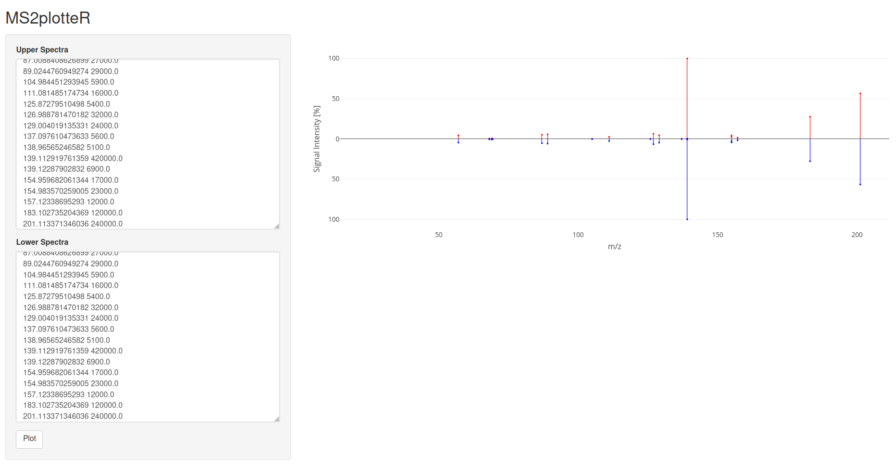

## MS2plotteR

This is a simple shiny app for getting the head-tail plot of two different spectra.
Copy & paste the m/z and intensity values from a file (msp or mgf) without any header an view the result. 

## Installation
Before first use, these following packages should be installed:

```{R}
install.packages("shiny")
install.packages("plotly")
install.packages("scales")

if (!require("BiocManager", quietly = TRUE))
    install.packages("BiocManager")

BiocManager::install("MsCoreUtils")
```

The Skript can be downloaded either via the command `git pull git@github.com:chufz/LittleHelpers.git` or as zip file over the link https://github.com/chufz/LittleHelpers/archive/refs/heads/main.zip


## Usage

Open the file `app.R` in RStudio and click on the `run App` Button on the right top of the skript window. The app should open in a seperate window.



## Walk through the application

(1) Copy & paste the values in the text boxes left and right
(2) Press the `plot` button. 
(3) Here we go.
