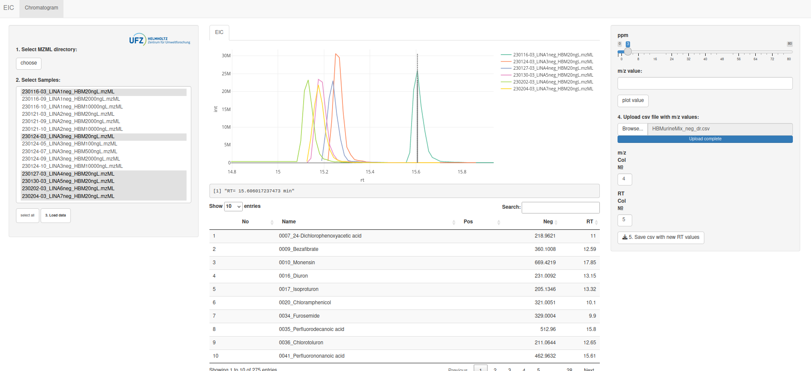

## RTadjuster

This is a shiny app for scrolling through EIC of a list of m/z values (e.g. a suspect screening or target screening list) to control the peak shapes and also to adjust the retention time (RT) values in the list.
For simplification and easy handling, the code is kept as simple and short as possible.

## Installation
Before first use, these following packages should be installed:

```{R}
install.packages(shiny)
install.packages(shinyWidgets)
install.packages(plotly)
install.packages(RaMS)
install.packages(shinyFiles)
install.packages(shinyjs)
install.packages(data.table)
install.packages(DT)
```

## Usage

Open the file `app.R` in RStudio and click on the `run App` Button on the right top of the skript window. The app should open in a seperate window.



## Walk through the application

(1) Start with choosing the mzml file directory
(2) Select the files that should be loaded (multiple choiceby using the the Ctrl- key)
(3) Click on the load button. Wait until the data is loaded. This is indicated in the console of RStudio.
(4.1) You can manually adjust the ppm value or enter a m/z value and click on the `plot value` button.
(4.2) You can upload your m/z list as csv file. Upload your file by clicking on the "Browse"button. Adjust the parameters in which columns the m/z and RT values are stored.
(4) By selecting an entry in the table, the EIC will be plotted. The dashed line is indicating the RT value in the table. This can be readjusted by doubleclick on the new value
(5) You can store the final table with the adjusted RT values.

